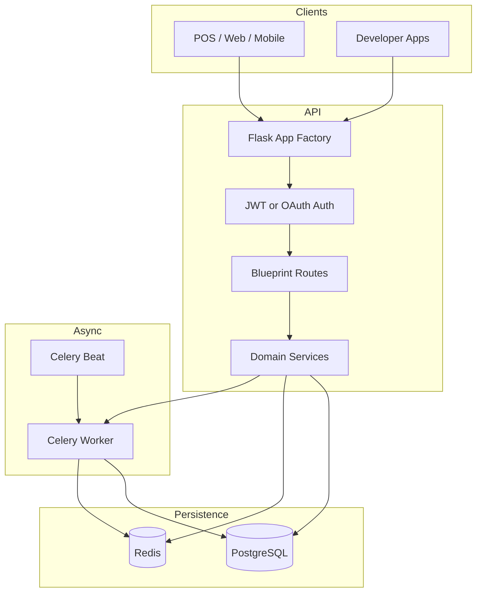

# RetailIQ: Integrated Retail & Embedded Finance Platform

RetailIQ is a Flask-based retail operating system that combines point-of-sale, inventory, analytics, forecasting, loyalty, supplier procurement, developer APIs, WhatsApp messaging, market intelligence, GST/compliance, and embedded-finance workflows behind one backend.

This README is a code-verified architecture and engineering guide for the current repository state. It is aligned to:

- `app/__init__.py`
- `app/factory.py`
- `config.py`
- the mounted route blueprints
- the SQLAlchemy model layer in `app/models/*.py`
- the API and service behavior asserted by the `tests/` suite

For the reusable Oracle Document generator prompt, see `oracle.md`.

## 🏗 System Architecture (Core Engine v1.0)

RetailIQ uses a Flask application factory with SQLAlchemy, Redis-backed limiter/session infrastructure, and Celery for async and scheduled work.

## Runtime Topology

- **API process**: Flask app served through WSGI/Gunicorn-compatible entrypoints
- **Database**: PostgreSQL in normal runtime, SQLite in-memory during tests
- **Redis**: rate limiting, token/session state, broker/backend support
- **Worker**: Celery task execution for snapshots, OCR, alerts, webhook delivery, and batch analytics jobs
- **Scheduler**: Celery Beat or equivalent scheduler for periodic background jobs

## High-Level Request and Worker Flow



## Application Bootstrap

`create_app()` in `app/factory.py` is the authoritative startup path.

- Loads config from `config.get_config()` or injected config
- Sets JWT defaults when absent
- Forces `sqlite:///:memory:` during tests
- Resolves `SQLALCHEMY_DATABASE_URI` from config or `DATABASE_URL`
- Normalizes `postgres://` to `postgresql://`
- Initializes `db` and `limiter`
- Resolves limiter storage from `RATELIMIT_STORAGE_URL`, `REDIS_URL`, or `CELERY_BROKER_URL`
- Enables CORS for `/api/*`
- Runs production readiness checks in production
- Registers all blueprints and JSON error handlers
- Exposes `GET /health` and `GET /`

## Mounted API Namespaces

The application registers the following major namespaces:

- `/api/v1/auth`
- `/api/v1/analytics`
- `/api/v1/barcodes`
- `/api/v1/chain`
- `/api/v1/customers`
- `/api/v1/dashboard`
- `/api/v1/decisions`
- `/api/v1/developer`
- `/api/v1/events`
- `/api/v1/forecasting`
- `/api/v1/gst`
- `/api/v1/i18n`
- `/api/v1/inventory`
- `/api/v1/kyc`
- `/api/v1/loyalty`
- `/api/v1/credit`
- `/api/v1/market`
- `/api/v1/marketplace`
- `/api/v1/nlp`
- `/api/v1/offline`
- `/api/v1/ops`
- `/api/v1/payments`
- `/api/v1/purchase-orders`
- `/api/v1/pricing`
- `/api/v1/receipts`
- `/api/v1/staff`
- `/api/v1/store`
- `/api/v1/suppliers`
- `/api/v1/tax`
- `/api/v1/team`
- `/api/v1/transactions`
- `/api/v1/vision`
- `/api/v1/whatsapp`
- `/api/v2`
- `/api/v2/ai`
- `/api/v2/einvoice`
- `/api/v2/finance`
- `/oauth`

---

## 🔐 Authentication & Security Architecture

RetailIQ uses two main auth patterns.

- **JWT merchant/staff auth** for `/api/v1/*`
- **OAuth-style bearer tokens** for developer integrations and selected `/api/v2/*` endpoints

## JWT Flows

- Registration issues OTP workflow
- OTP verification returns auto-login tokens
- Login returns access and refresh tokens
- Refresh rotates refresh tokens
- Logout revokes refresh tokens

The JWT context is used for:

- `user_id`
- `store_id`
- `role`

Some chain flows also rely on additional chain context in the token.

## Authorization Model

- `owner` has access to configuration, analytics, returns, pricing actions, and management endpoints
- `staff` can create transactions and manage staff sessions but is restricted from owner-only operations

## Security and Infra Controls

- Flask-Limiter is wired globally with Redis or in-memory fallback
- CORS is configurable via `CORS_ORIGINS`
- WhatsApp access tokens are encrypted at rest
- Production startup performs readiness validation
- Standard JSON error handlers are registered for `400`, `401`, `403`, `404`, `405`, `422`, `429`, and `500`

---

## ⚙️ Core Engineering Design Patterns

## Core Domain Patterns

### Store-scoped tenancy

Most operational entities are scoped to `store_id`. This is the main multi-tenant boundary across users, customers, products, transactions, suppliers, loyalty accounts, GST config, and analytics summaries.

### Thin routes, service-heavy mutations

Many modules keep request parsing in routes and push mutation logic into service/engine code.

Key examples:

- transaction processing in `app/transactions/services.py`
- pricing generation in `app/pricing/engine.py`
- forecasting in `app/forecasting/engine.py`
- finance lifecycle logic in `app/finance/*`
- market intelligence logic in `app/market_intelligence/engine.py`

### Atomic side-effect orchestration

The transaction service is the most important example of coordinated side effects:

- sales rows are written
- stock is decremented
- loyalty points may accrue
- credit ledger may change
- GST rows may be generated
- staff session attribution may be applied
- analytics rebuild and webhook side effects may be queued

### Read-model driven analytics

Analytics and forecasting APIs rely heavily on aggregate/cache tables rather than re-scanning raw transactional data on each request.

Important tables include:

- `DailyStoreSummary`
- `DailyCategorySummary`
- `DailySkuSummary`
- `ForecastCache`
- `AnalyticsSnapshot`

### Async-first for heavy work

Celery is used for:

- OCR processing
- analytics snapshot building
- webhook delivery
- periodic alert generation
- batch forecast/materialization workflows

### Compatibility and testability

- test suite adapts Postgres-only types for SQLite
- tests use `StaticPool` so Flask handlers and fixtures share one in-memory database
- `numpy_patch.py` exists for numeric-library compatibility in the test/runtime environment

---

## 📂 Project Structure & File Index

### 📦 `app/` (Core Application)

#### `__init__.py`
Defines extension singletons, blueprint registration, and JSON error handlers. Re-exports `create_app` from `app/factory.py`.

#### `auth/` (Identity & Permissions)
- `decorators.py`: auth and role guards
- `oauth.py` and `oauth_routes.py`: OAuth token and authorization flows
- `routes.py`: registration, OTP, login, refresh, logout
- `utils.py`: JWT generation, hashing, Redis token helpers

#### `finance/` (Embedded Finance Layer)
- `credit_scoring.py`: merchant score computation
- `ledger.py`: double-entry financial movements
- `loan_engine.py`: approval and disbursement behavior
- `insurance_engine.py`: policy enrollment and claims
- `treasury_manager.py`: sweep logic and treasury balance movement
- `routes.py`: `/api/v2/finance/*` endpoints

#### `models/` (Data Architecture)
- `__init__.py`: core operational models and imports of extension model modules
- `expansion_models.py`: country, payment, KYC, translation, and e-invoice models
- `finance_models.py`: lending, accounts, treasury, insurance, merchant KYC
- `marketplace_models.py`: catalog, RFQ, B2B orders, supplier reviews
- `missing_models.py`: developer platform and market-intelligence support models

#### `forecasting/` (AI Demand Sensing)
- `engine.py`: forecasting model selection, regime detection, forecast result construction
- demand sensing paths integrate with events and `DemandSensingLog`

#### `vision/` (OCR & Shelf Analytics)
- `parser.py`: OCR text parsing into structured invoice items
- `routes.py`: OCR upload, status, confirm, dismiss, shelf-scan, receipt digitization endpoints

#### `transactions/` (POS Core)
- `services.py`: transaction orchestration, returns, stock updates, loyalty/credit/GST hooks
- `routes.py`: create, batch, list, detail, return, daily summary

#### `inventory/` (Stock & Catalog)
- `routes.py`: product list/create/update/delete, stock updates, audits, alerts, price history
- `schemas.py`: product and stock audit validation

#### `receipts/` (Barcodes & Printing)
- barcode lookup, barcode registration, template upsert, print job creation

#### `gst/` (Tax & Compliance)
- GSTIN validation, HSN lookup, liability slabs, filing-period support

#### `nlp/` (Natural Language Assistant)
- intent resolution, query handling, and AI helper endpoints for NLP/recommendation flows

#### `market_intelligence/` (External Signals)
- market signals, price indices, alerts, intelligence reports, and market-aware pricing context

#### `tasks/` (Background Workers)
- periodic jobs for snapshots, alerts, forecasts, GST compilation, OCR, and operational maintenance

#### `utils/` (Infrastructure Helpers)
- reusable infrastructure helpers including security and webhook delivery support

## Other Important Top-Level Files

- `config.py`: environment-specific config classes and defaults
- `celery_worker.py`: Celery app bootstrap
- `wsgi.py`: WSGI entrypoint
- `alembic.ini` and `migrations/`: schema migration system
- `docker-compose.yml`: local dependency orchestration
- `requirements.txt`: Python dependency set
- `ruff.toml`: linting rules
- `tests/`: integration and unit tests covering auth, inventory, analytics, finance, expansion, vision, NLP, suppliers, transactions, WhatsApp, forecasting, and more

---

## 🛠 Developer & Engineer Guide

## Prerequisites

- Python `3.10+`
- PostgreSQL `14+` for normal local runtime
- Redis for limiter, auth token state, and Celery

## Environment Variables

The main runtime variables are:

- `SECRET_KEY`
- `FLASK_ENV`
- `ENVIRONMENT`
- `APP_VERSION`
- `DATABASE_URL`
- `REDIS_URL`
- `CELERY_BROKER_URL`
- `JWT_SECRET_KEY`
- `JWT_ACCESS_EXPIRES_HOURS`
- `JWT_REFRESH_EXPIRES_DAYS`
- `EMAIL_ENABLED`
- `SMTP_HOST`
- `SMTP_PORT`
- `SMTP_USER`
- `SMTP_PASSWORD`
- `SMTP_FROM`
- `CORS_ORIGINS`
- `RATELIMIT_ENABLED`
- `RATELIMIT_DEFAULT`
- `FRONTEND_URL`

Start from `.env.example` and copy the values you need into a local `.env`.

## Local Development Setup

```bash
pip install -r requirements.txt
copy .env.example .env
flask db upgrade
python -c "from app import create_app; app=create_app(); print(app.url_map)"
```

Typical API startup options:

```bash
python wsgi.py
```

or your preferred Flask/Gunicorn command wired to `create_app()`.

Typical worker startup:

```bash
celery -A celery_worker.celery_app worker --loglevel=info
celery -A celery_worker.celery_app beat --loglevel=info
```

## Docker and Compose

Local container orchestration is available through the Dockerfiles and compose files in the repo root.

Typical flow:

```bash
docker compose build
docker compose up -d
```

## Testing Guide

### Important test harness behavior

- Tests use in-memory SQLite with `StaticPool`
- Postgres-specific types are shimmed for SQLite in `tests/conftest.py`
- Rate limiting is disabled in tests
- JWT keys are generated dynamically for the test session
- Tables are cleaned between tests for isolation

### Recommended commands

Targeted regression commands:

```bash
pytest tests/test_auth_flow.py tests/test_inventory.py tests/test_transactions.py tests/test_receipts.py
pytest tests/test_analytics.py tests/test_pricing.py tests/test_store.py tests/test_suppliers.py
pytest tests/test_loyalty.py tests/test_finance.py tests/test_forecasting.py tests/test_gst.py
pytest tests/test_marketplace.py tests/test_market_intelligence.py tests/test_vision.py tests/test_whatsapp.py
```

Full suite:

```bash
pytest -v --tb=short -p no:cacheprovider
```

## Engineering Rules and Invariants

### Data and money handling

- Treat store scope as the primary tenancy boundary
- Avoid client-side authoritative recomputation of totals where server-computed values exist
- Keep transaction side effects atomic
- Preserve ledger consistency for finance flows

### API consumption guidance

- Do not assume a single response envelope shape across all modules
- Treat UUID-backed identifiers as opaque strings in clients
- Expect some routes to expose both slash and no-slash variants
- Handle cache-backed analytics and forecast endpoints as derived resources that may legitimately return `404` or empty state

### Documentation usage guidance

- Use `README.md` as the comprehensive system architecture and developer/engineer guide
- Use `oracle.md` as the reusable prompt template for generating a full backend audit document in Claude
- The Oracle prompt now explicitly instructs audit coverage for serializers/response mappers, custom error handlers, Flask request hooks, migrations, background jobs, signal hooks, middleware execution order, API versioning, date/time contracts, decimal precision, idempotency, caching behavior, inbound webhook-driven state changes, async job polling contracts, correlation headers, route-guard implementation patterns, shared-shape references, and truncation-recovery guidance
- Use generated Oracle output as a point-in-time frontend integration artifact, not as the permanent source of repo architecture truth

### Operational invariants

- product pricing validation rejects `selling_price < cost_price`
- customer mobile uniqueness is store-scoped
- OCR confirmation must succeed or fail atomically
- purchase-order receive flows must not partially commit inventory and GRN state on invalid input
- batch transaction ingestion is intentionally partial-success capable

## Frontend and Integration Notes

- Normalize API responses in a shared client adapter
- Distinguish owner and staff experiences at the route and feature level
- Treat `/api/v2/*` developer access separately from merchant/staff JWT access
- Generate a point-in-time Oracle backend audit from `oracle.md` when you need endpoint-level contracts, field expectations, and verified edge cases

## Deployment Notes

The repo includes deployment infrastructure for containerized environments and cloud targets.

Important operational notes:

- `DATABASE_URL` must resolve to a valid SQLAlchemy/Postgres DSN
- `REDIS_URL` must point to a real Redis instance in production
- `CELERY_BROKER_URL` should be a valid broker URL and not a broken suffix-only value
- `/health` is the canonical liveness endpoint
- production boot runs readiness checks via `app.utils.security.check_production_readiness`

## Recommended Reading Order for New Engineers

1. `app/factory.py`
2. `app/__init__.py`
3. `config.py`
4. `app/models/__init__.py`
5. `app/transactions/routes.py` and `app/transactions/services.py`
6. `app/inventory/routes.py`
7. `app/analytics/routes.py`
8. `app/forecasting/engine.py`
9. `tests/conftest.py`
10. `oracle.md`

## Verified Backend Audit Snapshot

The latest code-verified backend audit produced `Retailiq-backend.txt` in the repo root.

- **Auth split**: JWT merchant/staff auth lives under `/api/v1/*`, while developer integrations use opaque OAuth bearer tokens under `/oauth` and `/api/v2/*`.
- **Response shape caution**: the preferred envelope is `format_response(...)`, but several routes still return raw `jsonify(...)` payloads or partial objects, so client normalization is required.
- **Tenancy rule**: `store_id` is the primary isolation boundary across operational entities.
- **Async rule**: OCR, analytics snapshots, GST compilation, webhook delivery, forecasting, and alerting are task-driven and should be treated as eventually consistent.
- **Realtime rule**: market intelligence uses Socket.IO on the `/market` namespace, but auth is not enforced at connect time yet.
- **Docs rule**: the generated OpenAPI artifacts are useful for discovery, but the codebase and tests remain the source of truth when they disagree.

## Current Documentation Set

- `README.md`: system architecture and engineer guide
- `oracle.md`: Oracle Document generator prompt template for producing an exhaustive backend audit with frontend-focused guidance on serializer-visible fields, error envelopes, async flows, versioning, retries, precision, time handling, correlation IDs, route guards, shared object references, and severity-ranked risks
- `Retailiq-backend.txt`: latest verified backend findings artifact for frontend and integration planning; now includes the Oracle Expansion Appendix with code-backed auth, endpoint, serialization, and screen notes
- `API_GUIDE.md`: additional project API notes
- `DEPLOYMENT.md`: deployment-specific instructions

---

© 2026 Team RetailIQ.
